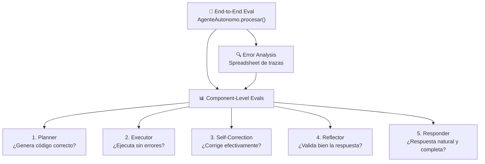
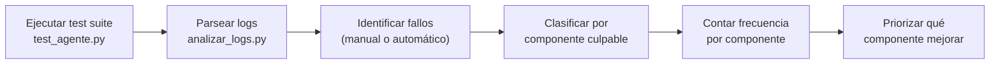
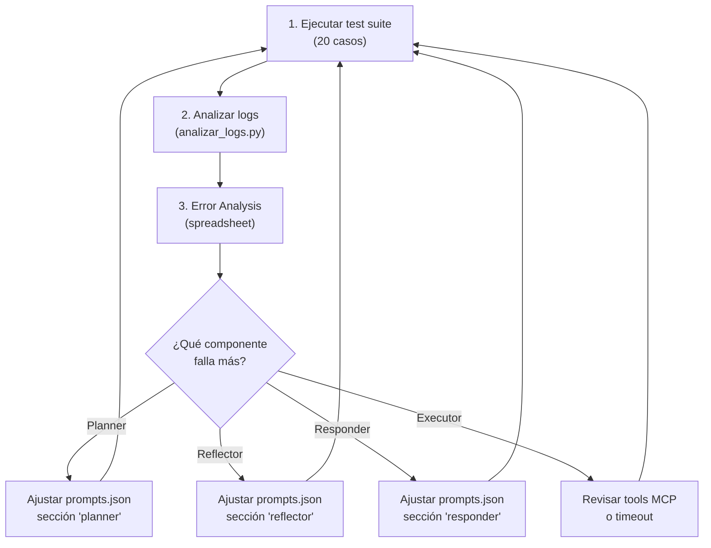

# Estrategia de Evaluación del Code Planner Agent

Documento de estrategia para sistematizar la evaluación del agente Code Planner de GESTOR_WS, aplicando los principios del **Module 4: Practical Tips for Building Agentic AI** (Andrew Ng / DeepLearning.AI) a la arquitectura específica del proyecto.

---

## 1. Mapeo: Tu Arquitectura → Framework del Módulo 4

El PDF establece dos niveles de evaluación: **End-to-End Evals** y **Component-Level Evals**, más un proceso continuo de **Error Analysis**. Así se mapea tu sistema:

| Concepto del PDF | Tu Componente | Archivo |
|---|---|---|
| Agentic Workflow | Grafo LangGraph (5 nodos) | [code_planner.py](file:///C:/Users/u14527001/Downloads/GESTOR_WS/gestor_ws/app/agents/code_planner.py) |
| Trace completa | `CodePlannerState` (todo el dict de estado) | [states.py](file:///C:/Users/u14527001/Downloads/GESTOR_WS/gestor_ws/app/agents/states.py) |
| Span (output de un paso) | Output de cada nodo (`generated_code`, `execution_result`, etc.) | Campos del `CodePlannerState` |
| End-to-End Eval | `final_response` vs `esperado` en test cases | [test_agente.py](file:///C:/Users/u14527001/Downloads/GESTOR_WS/gestor_ws/tests/test_agente.py) |
| Error Analysis Spreadsheet | Log analysis existente | [analizar_logs.py](file:///C:/Users/u14527001/Downloads/GESTOR_WS/gestor_ws/tests/analizar_logs.py) |

---

## 2. Las 5 Estrategias de Evaluación

### Estrategia 1: End-to-End Evals con Dataset Tipificado

> *"Build evals on a small dataset, maybe just 10, 20 examples, to compute metrics on end-to-end performance"* — Module 4

**Qué evalúa:** La calidad global de respuesta del agente completo.

**Tu base actual:**  
Tenés 11 test cases en [test_data_larga.txt](file:///C:/Users/u14527001/Downloads/GESTOR_WS/gestor_ws/tests/test_agente/test_data_larga.txt), pero solo miden "éxito/fallo" (si el agente respondió sin excepción). **No evalúan calidad de la respuesta.**

**Estrategia propuesta:**

| Dimensión | Métrica | Cómo medir |
|---|---|---|
| **Correctitud factual** | ¿La respuesta contiene los datos correctos? | Comparar contra una `expected_answer` con keywords obligatorias |
| **Completitud** | ¿Responde a TODAS las partes de la consulta? | Para consultas MIXTAS, verificar N keywords esperadas |
| **Tono y formato** | ¿Es natural, empático, con emojis moderados? | LLM-as-Judge con rúbrica de 1-5 |
| **Latencia** | Tiempo total de procesamiento | `time.time()` antes/después de `procesar()` |
| **Costo** | Tokens consumidos | `token_tracker` ya existente |

**Dataset mínimo recomendado (20 casos):**

| Categoría | Casos | Complejidad |
|---|---|---|
| Financiero simple | 4 | Baja |
| Financiero con alumno no vinculado | 2 | Media (regla VALIDA NOMBRES) |
| Institucional (RAG) | 4 | Media |
| Mixto (financiero + institucional) | 3 | Alta |
| Identidad / contexto | 3 | Media (verificar `user_context`) |
| Edge cases (vacío, emojis, saludo puro) | 4 | Baja |

---

### Estrategia 2: Component-Level Evals (Nodo por Nodo)

> *"Build component-level evals... build an eval just to measure the quality of [each] component"* — Module 4

Cada nodo del grafo se evalúa aislado:

#### 2a. Eval del Planner (el más crítico)

| Qué evaluar | Input de test | Métrica esperada |
|---|---|---|
| **Genera función `execute` válida** | Mensaje + contexto mock | `exec(code)` no lanza excepción |
| **Usa tools correctas** | "¿Cuánto debo?" | Código contiene `consultar_estado_cuenta` |
| **Prioriza RAG** | "Horario de administración" | Código contiene `buscar_info_institucional` (no `crear_ticket`) |
| **Valida nombres** | "Deuda de Pedro" (no vinculado) | Código verifica la lista `alumnos` |
| **Usa contexto directo** | "¿Conoces a Juan?" (en alumnos) | Código NO llama a tools, usa `context['user']` |
| **Maneja multi-pregunta** | "Debo cuotas? Y horario de admin?" | Código invoca 2+ tools |

#### 2b. Eval del Executor

| Qué evaluar | Métrica |
|---|---|
| Ejecución exitosa | `execution_error` es `None` |
| Resultado tiene estructura | `result` tiene `success`, `data`, `summary` |
| Timeout NO se excede | Duración < 30s |

#### 2c. Eval del Reflector

| Qué evaluar | Métrica |
|---|---|
| Acepta resultados válidos | `reflection_valid = True` para datos correctos |
| Rechaza resultados vacíos | `reflection_valid = False` si `success=False` |
| Relajación funciona | Tras 1+ corrección, acepta resultados parciales |

#### 2d. Eval del Responder

| Qué evaluar | Métrica |
|---|---|
| Respuesta no vacía | `len(final_response) > 0` |
| Contiene datos del resultado | Keywords del `execution_result` aparecen en respuesta |
| Formato WhatsApp | No excede 4 párrafos, usa emojis con moderación |

---

### Estrategia 3: Error Analysis con Spreadsheet de Trazas

> *"Build out a spreadsheet to explicitly count up where the errors are"* — Module 4

**Metodología:** Para cada caso fallido, inspeccionar la traza completa y anotar qué componente causó el fallo.

**Plantilla de Spreadsheet:**

| # | Consulta | Planner ❌ | Executor ❌ | Reflector ❌ | Responder ❌ | Causa raíz | Acción |
|---|---|---|---|---|---|---|---|
| 1 | "Deuda de Marquita" | ✅ | ✅ | ❌ | - | Reflector rechazó resultado válido | Ajustar prompt reflector |
| 2 | "Horario admin" | ❌ | - | - | - | Planner generó `crear_ticket` en vez de `buscar_info` | Reforzar regla PRIORIDAD RAG |
| 3 | "Hola" | ✅ | ✅ | ✅ | ❌ | Responder generó texto demasiado largo | Ajustar prompt responder |

**Tu herramienta existente:** [analizar_logs.py](file:///C:/Users/u14527001/Downloads/GESTOR_WS/gestor_ws/tests/analizar_logs.py) ya parsea logs y traza eventos del Code Planner. Es la base perfecta para exportar a CSV/spreadsheet.

**Flujo de Error Analysis:**

---

### Estrategia 4: Métricas de Costo y Latencia por Componente

> *"Measuring the cost and/or latency of each step often gives you a basis to decide which component to focus on"* — Module 4

**Ya tenés base:** El `token_tracker` registra tokens por sesión. Pero no detalla **por nodo**.

**Métricas a capturar (sin modificar código, solo leyendo logs):**

| Métrica | Fuente | Cómo |
|---|---|---|
| Tokens totales por consulta | `token_usage.log` | `parse_token_log()` en `analizar_logs.py` |
| Latencia total | `gestor_ws.log` | Timestamp primer `[PLANNER]` → último `[RESPONDER]` |
| N° de iteraciones Planner | `gestor_ws.log` | Contar `[PLANNER] Iteración N/5` |
| N° de correcciones | `gestor_ws.log` | Contar `Self-correction: intento N` |
| Tasa de éxito del Executor | `gestor_ws.log` | Ratio `✅ Éxito` vs `❌ Error` |
| Rechazos del Reflector | `gestor_ws.log` | Contar `[REFLECTOR] ❌ Inválido` |

**Señales de alerta:**

| Señal | Indica |
|---|---|
| `planner_iterations > 2` | Planner no converge — prompt necesita ajuste |
| `correction_count >= 2` | Código generado tiene bugs recurrentes |
| Latencia total > 15s | Experiencia de usuario mala en WhatsApp |
| Tokens > 10,000 por consulta | Costo excesivo por interacción |

---

### Estrategia 5: Proceso Iterativo Build ↔ Analyze

> *"I often go back and forth between building and analyzing... The workflow goes back and forth. It's not a linear process."* — Module 4

**El ciclo propuesto para tu equipo:**

**Fases de madurez progresiva:**

| Fase | Actividad | Ya lo tenés? |
|---|---|---|
| **1. Prototipo** | Pruebas manuales con sandbox interactivo | ✅ `sandbox.py` |
| **2. Inicial** | Suite de 10-20 test cases, observar output | ✅ `test_agente.py` + `test_data_larga.txt` (pero falta validación automática) |
| **3. Sistemático** | Error analysis con spreadsheet, contar errores por componente | 🔶 `analizar_logs.py` existe pero no clasifica errores |
| **4. Maduro** | Component-level evals automatizados, métricas en cada push | ❌ No existe aún |
| **5. Optimización** | Tracking de costo/latencia por nodo, pruebas A/B de prompts | ❌ No existe aún |

---

## 3. Resumen Ejecutivo: Plan de Acción Sin Código

> [!IMPORTANT]
> El PDF enfatiza que los equipos menos experimentados dedican demasiado tiempo a *building* y muy poco a *analyzing*. La mayor ganancia para tu sistema viene de **sistematizar el error analysis** con los logs que ya generás.

### Quick Wins (se pueden hacer HOY sin modificar código):

1. **Expandir `test_data_larga.txt`** de 11 a 20+ casos con keywords esperadas más precisas
2. **Ejecutar `analizar_logs.py`** después de cada test run y anotar en un spreadsheet qué componente falló
3. **Medir latencia manualmente** cronometrando las respuestas del sandbox

### Inversiones Medianas (requieren desarrollo):

4. **Automatizar la clasificación de errores** — extender `analizar_logs.py` para generar el spreadsheet automáticamente
5. **Agregar LLM-as-Judge** — usar un segundo LLM para puntuar la calidad de `final_response` contra criterios de rúbrica
6. **Component-level evals** — scripts que prueben cada nodo aislado (ej: enviar código generado al Executor sin pasar por el Planner)

### Visión a Futuro:

7. **Regression tests** — guardar trazas "golden" y comparar automáticamente ante cambios en `prompts.json`
8. **A/B testing de prompts** — cambiar una regla en el prompt del Planner, correr los 20 tests, comparar métricas
9. **Dashboard de salud del agente** — gráfico de tasa de éxito, latencia promedio, costo por consulta a lo largo del tiempo
